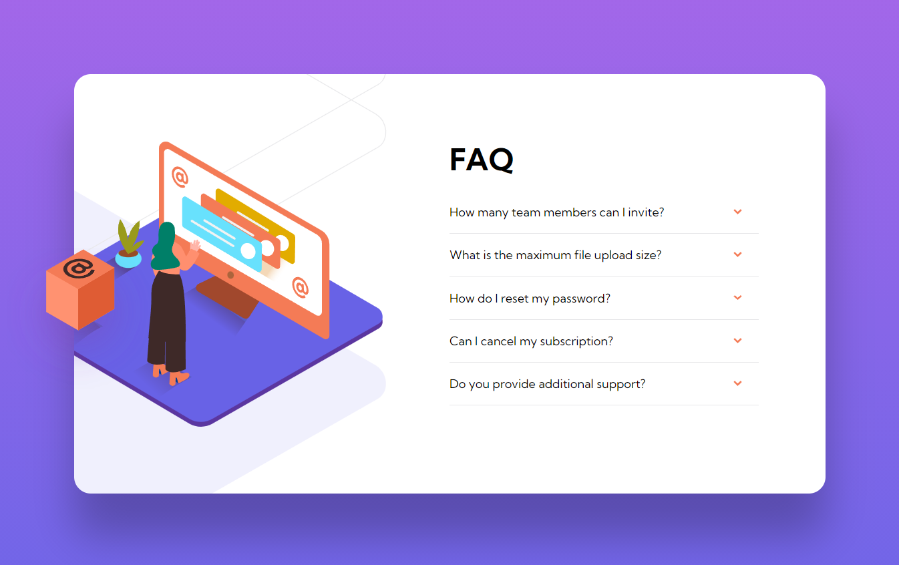

# Frontend Mentor - FAQ accordion card

This is a solution to the [FAQ accordion card challenge on Frontend Mentor](https://www.frontendmentor.io/challenges/faq-accordion-card-XlyjD0Oam). Frontend Mentor challenges help you improve your coding skills by building realistic projects.

### About

Fourth exercice from Frontend Mentor website. The purpose is to train HTML, SCSS.

**HTML, SCSS**

[Preview-site](https://florianjourde.github.io/Frontend-Mentor-5-FAQ-accordion-card-main)
